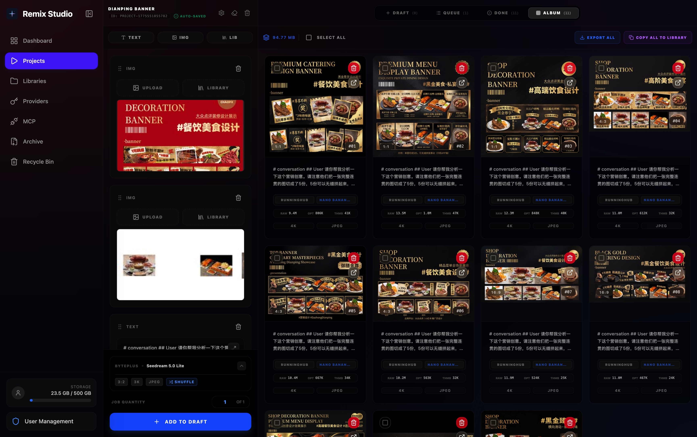
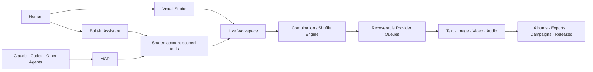

# Remix Studio — AI-Native Content Operations for Humans and Agents

Remix Studio gives creators, teams, and AI agents a shared, self-hosted environment for multimodal generation and social campaigns. Operate the same live workspace through the visual studio, the built-in tool-using assistant, or external MCP clients such as Claude and Codex.

One account-scoped tool layer powers both AI control surfaces. The assistant and connected agents can work directly with libraries, projects, workflows, albums, models, storage, campaigns, and posts.

## One Workspace, Three Control Surfaces

| Control surface | Role |
| --- | --- |
| **Visual Studio** | Precise hands-on control over libraries, workflows, drafts, queues, results, exports, and campaigns |
| **Built-in Assistant** | Persistent, multimodal chat that can inspect the workspace and take confirmed actions using your chosen AI provider and model |
| **MCP Server** | The same core tools exposed to external agents over streamable HTTP, authenticated with OAuth 2.0 + PKCE or personal access tokens |

The assistant can bind projects and libraries as context, work with images and voice input, use reusable prompt skills, and preserve conversations. Both agent paths can discover current data instead of reasoning over a stale prompt: they can curate libraries, inspect albums and files, find usable models, assemble project workflows, and prepare campaigns and scheduled posts.

```mermaid
flowchart LR
    H["Human"] --> UI["Visual Studio"]
    H --> A["Built-in Assistant"]
    G["Claude · Codex · Other Agents"] --> M["MCP"]
    A --> T["Shared account-scoped tools"]
    M --> T
    UI --> W["Live Workspace"]
    T --> W
    W --> E["Combination / Shuffle Engine"]
    E --> Q["Recoverable Provider Queues"]
    Q --> O["Text · Image · Video · Audio"]
    O --> D["Albums · Exports · Campaigns · Releases"]
```

## From Intent to Distribution

- **Build reusable knowledge** — Organize prompts, images, video, and audio in typed libraries with titles, tags, search, import/export, browser capture, and mobile sharing.
- **Direct the system in natural language** — Ask the assistant or an MCP agent to inspect what already exists, create or refine libraries, assemble multimodal projects, and prepare campaign posts.
- **Compose at scale** — Mix fixed inputs with library-backed choices. Run the Cartesian product for exhaustive coverage or use shuffle mode for bounded exploration: 3 subjects × 4 styles × 2 references becomes 24 reviewable drafts.
- **Review before execution** — Remix Studio separates composition from provider calls. Inspect resolved prompts, media contexts, model settings, and workflow snapshots, then queue only the drafts worth running.
- **Run resiliently across providers** — Model profiles drive valid controls for text, image, video, audio, and music workflows. Database-backed jobs, per-provider concurrency, detached polling, restart recovery, retries, and live project updates keep batches moving.
- **Turn output into operations** — Keep results in durable albums, reuse prior configurations, edit and export assets, add watermarks, release archives to connected drives such as Google Drive and OneDrive, publish products to storefronts, or schedule campaigns for X and Threads.
- **Move whole projects around** — Package a project's settings, workflow, album, and media into a single ZIP, then import it back as a new project on any deployment.

## Human Control Where It Matters

Agent access stays powerful without becoming opaque. Read tools execute directly; writes pause for a human-readable review. The in-app assistant supports per-conversation tool approvals, while external MCP writes use a two-step preview and confirmation hash bound to the exact arguments. Destructive actions remain explicitly gated.

Every tool enforces user ownership. Provider credentials and connected-service tokens are encrypted at rest, stored files are shared through temporary owned URLs, and the multi-user application includes roles, invite-based registration, storage limits, TOTP 2FA, and passkeys.

## Self-Hosted by Design

Run Remix Studio with PostgreSQL, S3-compatible object storage, and Docker. Bring your own model providers, credentials, storage, social applications, and deployment secrets. Install the web app as a PWA and use it in English, Simplified Chinese, Traditional Chinese, Japanese, Korean, or French.

## Documentation

Find detailed setup, configuration, and operations guidance on the [documentation site](https://shinchven.github.io/remix-studio/).

- [Architecture](https://shinchven.github.io/remix-studio/guide/architecture) and [why Remix Studio is different](https://shinchven.github.io/remix-studio/guide/why-different)
- [Built-in assistant](https://shinchven.github.io/remix-studio/concepts/assistant) and [MCP integration](https://shinchven.github.io/remix-studio/integrations/mcp)
- [Workflows and combinations](https://shinchven.github.io/remix-studio/concepts/workflows) and [supported AI workflows](https://shinchven.github.io/remix-studio/concepts/supported-workflows)
- [Providers and models](https://shinchven.github.io/remix-studio/concepts/providers), [campaigns](https://shinchven.github.io/remix-studio/concepts/campaigns), and [exports](https://shinchven.github.io/remix-studio/concepts/exports)
- [Local development](https://shinchven.github.io/remix-studio/guide/local-development) or [Docker deployment](https://shinchven.github.io/remix-studio/guide/docker-deployment)

## Community and License

Report bugs and request features through [GitHub Issues](https://github.com/ShinChven/remix-studio/issues). Released under the [MIT License](LICENSE).
